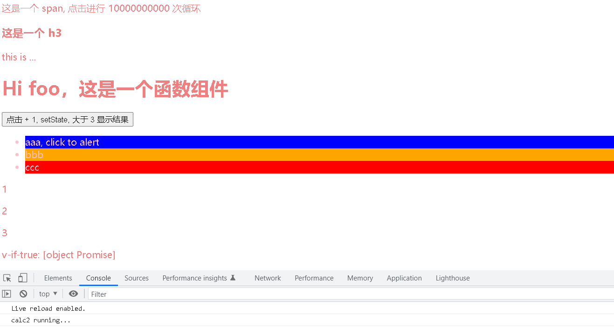
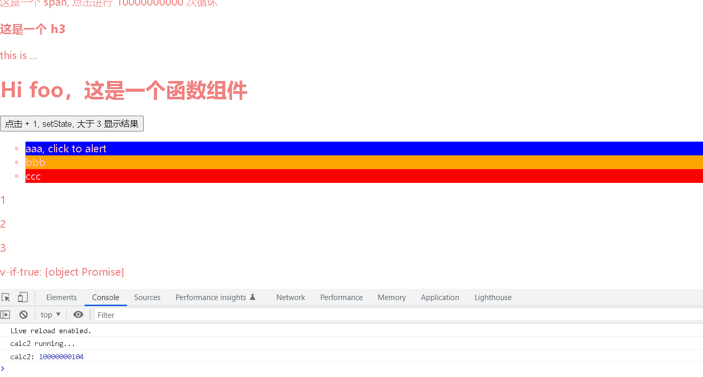

> 基于 React 的简易双线程小程序运行时

### 使用说明
- ``git clone https://github.com/Shaun-Shane/Microapp.git && cd Miscroapp``

- ``npm install && npm run start``

<center class="half">

</center>

### 项目说明
- 手写了简易 react 框架，支持 vdom 渲染，利用 babel 进行 DSL 编译。详见 ``framework/mini-react/mini-react.js``。
<br/>

- 使用 fiber 和 diff 提高渲染效率

  react fiber没法缩短整颗树的渲染时间，但它使得渲染过程被分成一小段、一小段的，相当于有了 “保存工作进度” 的能力，js每渲染完一个单元节点，就让出主线程，丢给浏览器去做其他工作，然后再回来继续渲染，依次往复，直至比较完成，最后一次性的更新到视图上。

  具体实现见 ``framework/mini-react/mini-react.js`` 中的``reconcileChildren``、``performUnitOfWork``、``commitRoot``、``commitWork``、``updateDom``、``workLoop`` 等函数。
<br/>

-  支持函数与组件

    ```jsx
    function Item (props) {
        return <li className="item" style={props.style} onClick={props.onClick}>{props.children}</li>;
    }

    class List extends Component {
        constructor (props) {
            super ();
            ...
        }

        render () {
            return <ul className="list">
                {this.state.list.map((item, index) => {
                    return <Item
                            style={{ background: item.color, color: this.state.textColor}}
                            onClick={() => alert(item.text)}>
                                {item.text}
                            </Item>
                })}
            </ul>;
        }
    }
    ```
<br/>

- 支持简单 hook, useState 

    具体实现见 ``framework/mini-react/mini-react.js`` 中的 ``useState`` 函数。
    ```jsx
    function Counter () {
        const [state, setState] = useState(1)
        return (
            <div>
                <button onClick={() => setState(c => c + 1)}>
                    点击 + 1, setState, 大于 3 显示结果
                </button>
                <p r-if={state > 3}>
                    Count: {state}
                </p>
            </div>
        )
    }
    ```
<br/>

- 支持 if、简单 for 循环的编译

    通过 babel 插件实现，在 babel 过程中对抽象语法树节点进行修改，转换为目的代码对应的抽象语法树节点。具体实现见 ``framework/transform.js``。
    ```jsx
    <p r-for={(item, index) in arr} key={index}>
        {item}
    </p>

    <p r-if={state > 3}>
        Count: {state}
    </p>
    ```
<br/>

- 双线程通信

    为了避免 CPU 密集任务阻塞渲染，在小程序启动时将用户的部分函数转为 string，并通过 ``addFunc`` 添加到 WebWorker。此后渲染线程通过 ``invoke`` 函数向 WebWorker 发送计算请求，由 WebWorker 计算后通过 ``postMessage`` 返回结果。
    具体实现见 ``framework/invoke.js`` 和 ``framework/worker.js``。
    此外 ``framwwork/utils.js``中的 ``modifyCode`` 函数会对编译后的 js 文件进行再修改，将用户函数转化为 ``await invoke`` 形式。
<br/>

- 小程序运行时

    使用 node.js 进行 ``pages`` 中的用户代码编译、修改。并将页面 js 和 css 插入到 ``index.html`` 中、创建 worker 线程。
    随后通过 live-server 启动页面，同时运行 node、渲染、逻辑层代码。
    目前仅支持单页面，可通过 ``load(page)`` 函数动态加载。页面切换 api 有待后续开发。
<br/>

### 结果演示 (加载可能较慢，可见 images/display.gif)
  - 成功进行了渲染和界面更新。
  - 当点击 span 执行 cpu 密集型任务后，并未阻塞渲染。
  - 逻辑线程结果产生后，成功返回结果。最后由渲染层通过 alert 显示结果。

<center class="half">
    
</center>
